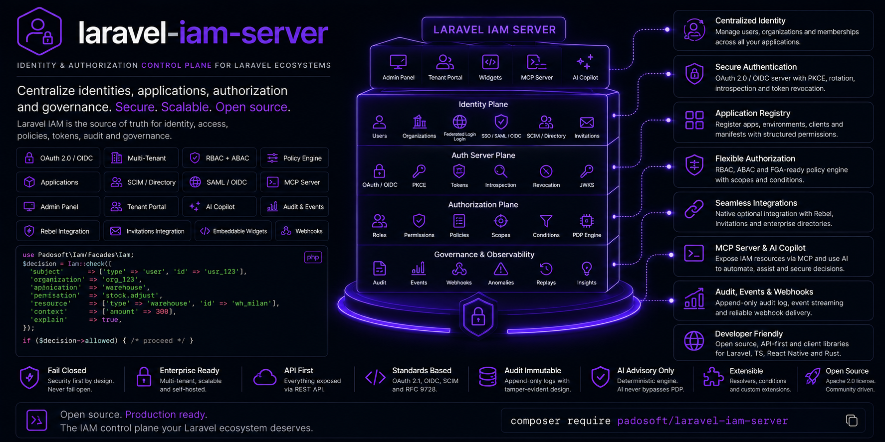

<p align="center">
  
</p>

<h1 align="center">Laravel IAM — Directory</h1>

<p align="center">
  <strong>Bring your LDAP / Active Directory into Laravel IAM — safely.</strong><br>
  Directory login, Just-In-Time provisioning and group&nbsp;→&nbsp;role mapping, hardened against the
  classic identity-sync pitfalls.
</p>

<p align="center">
  <a href="https://github.com/padosoft/laravel-iam-directory/actions/workflows/tests.yml"></a>
  <a href="https://packagist.org/packages/padosoft/laravel-iam-directory"></a>
  <a href="https://packagist.org/packages/padosoft/laravel-iam-directory"></a>
  <a href="https://packagist.org/packages/padosoft/laravel-iam-directory"></a>
  <a href="LICENSE"></a>
</p>

---

## Why this package

Most teams already have their users in **LDAP or Active Directory**. Wiring that into an app usually means
one of two bad outcomes: a brittle hand-rolled bind that silently fails open, or a "sync everything" job
that happily **takes over local accounts**, **keeps stale privileges forever**, and lets a single wrong row
in a group-mapping table **escalate a user to admin**.

`laravel-iam-directory` is the **optional Directory module** of [Laravel IAM](https://github.com/padosoft).
It authenticates against your directory, **provisions users Just-In-Time** on first login, and keeps their
IAM roles in sync with their **directory groups** — while closing every one of those pitfalls by design:

- **Anti-takeover** — an email already owned by a *non-directory* account is never auto-linked. You get a
  `conflict`, not a hijack.
- **No privilege persistence** — drop a user from an LDAP group and the matching role is **revoked** on the
  next sync. Manually-granted roles are never touched.
- **Protected roles** — list the roles (e.g. `iam:super_admin`) that can *never* be granted through group
  mapping, no matter what the directory says.
- **Fail-closed** — bad credentials or a connector error resolve to *denied*, never to a half-provisioned
  user.

The real LDAP transport (LdapRecord) is **optional and isolated**: the core works against any
`DirectoryConnector`, so you can test, map and provision without `ext-ldap` installed.

## Features

- **`DirectoryAuthenticator`** — the login entry point: *authenticate → map groups → provision/sync*, all
  fail-closed.
- **`GroupMapper`** — maps a user's directory groups to IAM roles (`full_key`), accepting both the full DN
  and the short CN, case-insensitively. Unmapped groups are ignored (default-deny — no implicit roles).
- **`DirectoryProvisioner`** — JIT on first login (creates user + membership + grants) and an **authoritative,
  idempotent sync** afterwards that adds missing roles and **revokes** stale directory-sourced ones.
- **`DirectoryJitPolicy`** — secure-by-default: `require_verified_email`, `allowed_domains`,
  `approval_required`, `default_roles`, `group_mapping`, and **`protected_roles`**.
- **`DirectoryUser` / `DirectoryConnector`** — a normalized identity and a transport seam, so the core is
  decoupled from LDAP and trivially testable.
- **`DirectoryOutcome`** — a typed result: `provisioned` · `linked` · `conflict` · `pending` · `denied`.
- **Optional `Ldap\LdapConnector`** — the real LDAP/AD transport via LdapRecord, isolated so the package
  installs and analyses cleanly without `ext-ldap`.

## Use cases

- **SSO-less LDAP/AD login.** Let enterprise users sign in with their directory credentials, without
  standing up a full SAML/OIDC IdP.
- **Auto-provision on first login.** New hire appears in AD → on first login they get an IAM user,
  membership and the right roles, with no manual onboarding.
- **Keep roles in sync with AD groups — safely.** Group membership changes flow into IAM roles on every
  login, with stale roles revoked and protected roles never auto-granted.

## Installation

```bash
composer require padosoft/laravel-iam-directory
```

**Requirements:** PHP **8.3+**, Laravel **13**, and a running **Laravel IAM server**
(`padosoft/laravel-iam-server`).

The real **LDAP/Active Directory** transport is optional and needs the PHP `ext-ldap` extension:

```bash
composer require directorytree/ldaprecord-laravel   # enables Ldap\LdapConnector
```

Without it, the core (group mapping + JIT) still works against any `DirectoryConnector` you provide — handy
for tests and non-LDAP sources.

Publish the config:

```bash
php artisan vendor:publish --tag=iam-directory-config
```

## Quick start

### 1. Configure the directory & mapping

`config/iam-directory.php`:

```php
return [
    // Target organization for provisioning (null = global users without a membership).
    'organization_id' => env('IAM_DIRECTORY_ORG'),

    'jit' => [
        'require_verified_email' => true,
        'allowed_domains'        => ['acme.com'],          // [] = no domain restriction
        'approval_required'      => false,
        'default_roles'          => ['iam:tenant_member'], // bootstrap roles (full_key)
        'group_mapping'          => true,
        // Roles that can NEVER be granted via group mapping (manual-only):
        'protected_roles'        => ['iam:super_admin'],
    ],

    // Directory group → IAM role(s). Key = full DN or short CN (case-insensitive).
    'group_map' => [
        'cn=warehouse-admins,ou=groups,dc=acme,dc=com' => 'warehouse:admin',
        'developers' => ['app:developer', 'app:deployer'],
    ],
];
```

### 2. Authenticate a user against the directory

```php
use Padosoft\Iam\Directory\DirectoryAuthenticator;

$outcome = app(DirectoryAuthenticator::class)->login($username, $password);

match ($outcome->status) {
    'provisioned', 'linked' => Auth::loginUsingId($outcome->userId), // roles already synced
    'pending'  => back()->withErrors(__("Access pending: {$outcome->reason}")),
    'conflict' => back()->withErrors(__('That email belongs to an existing account — manual link required.')),
    'denied'   => back()->withErrors(__('Invalid credentials.')),
};
```

### 3. The roles stay in sync — automatically

On every login the provisioner re-syncs the user's directory-sourced roles:

- user added to `developers` in AD → gets `app:developer`, `app:deployer`
- user removed from `warehouse-admins` → `warehouse:admin` is **revoked** (manual grants untouched)
- `iam:super_admin` mapped by a rogue group row → **ignored** (it's a protected role)

### 4. Use a custom (non-LDAP) source

Implement `DirectoryConnector` to provision from any source — no `ext-ldap` needed:

```php
use Padosoft\Iam\Directory\Contracts\DirectoryConnector;
use Padosoft\Iam\Directory\DirectoryUser;

final class CsvDirectoryConnector implements DirectoryConnector
{
    public function authenticate(string $username, string $password): ?DirectoryUser
    {
        // verify credentials; return null (= denied) on failure — never throw an opaque error
        return new DirectoryUser(
            username: $username,
            email: 'jane@acme.com',
            emailVerified: true,
            groups: ['developers'],
        );
    }

    public function find(string $username): ?DirectoryUser { /* lookup without credentials */ }
}
```

> ⚠️ **Security model.** This module is deliberately strict: it refuses account takeover by email collision,
> revokes stale directory roles on sync, and never grants `protected_roles` from the directory. Don't relax
> these in a custom connector — see [`docs/provisioning-and-security.md`](docs/provisioning-and-security.md).

## Ecosystem

| Package | Role |
| --- | --- |
| [laravel-iam-contracts](https://github.com/padosoft/laravel-iam-contracts) | Shared interfaces & DTOs — the dependency root |
| [laravel-iam-server](https://github.com/padosoft/laravel-iam-server) | The IAM server: identity, PDP, OAuth/OIDC, audit, governance, Admin API & panel |
| [laravel-iam-client](https://github.com/padosoft/laravel-iam-client) | Client for apps consuming Laravel IAM: middleware, Gate adapter |
| [laravel-iam-ai](https://github.com/padosoft/laravel-iam-ai) | Optional AI module: advisory-only governance |
| **laravel-iam-directory** *(this repo)* | Optional directory module: LDAP / Active Directory (LdapRecord); SCIM in v2 |
| [laravel-iam-bridge-spatie-permission](https://github.com/padosoft/laravel-iam-bridge-spatie-permission) | Migration bridge from spatie/laravel-permission |

## Documentation

A docmd doc-site lives in [`docs/`](docs/): start at [`docs/index.md`](docs/index.md), then
[Getting started](docs/getting-started.md), [Concepts](docs/concepts.md),
[Provisioning & security](docs/provisioning-and-security.md), [LDAP setup](docs/ldap-setup.md) and the
[Reference](docs/reference.md).

## Security

Laravel IAM is **fail-closed by design**. This module adds directory-specific hardening: anti-takeover
(email collision → `conflict`), stale-privilege revocation on sync, and `protected_roles` that the directory
can never grant. The directory assigns *roles*; the **PDP**, not this module, decides allow/deny. If you
discover a security issue, email **security@padosoft.com** rather than opening a public issue.

## License

MIT © [Padosoft](https://www.padosoft.com). See [LICENSE](LICENSE).
