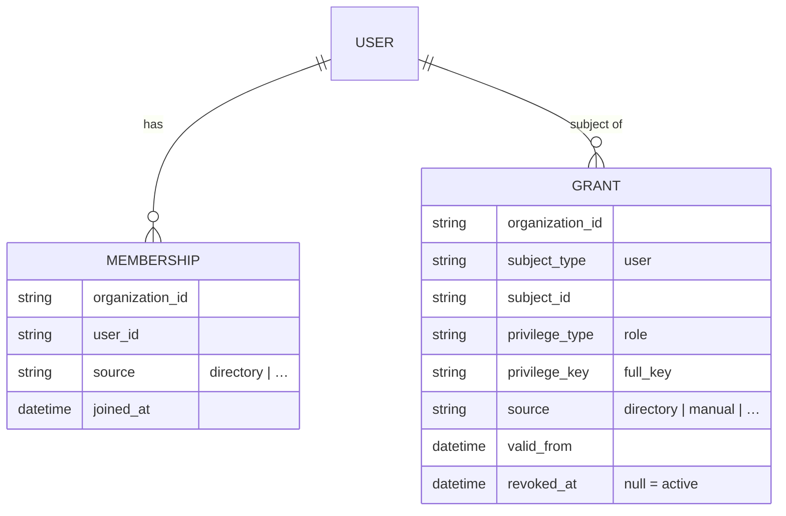

# Data model & contract

## Two sides of the contract

The module has an **input contract** (the normalized `DirectoryUser` a connector must produce) and an
**output contract** (the `User` / `Membership` / `Grant` rows the provisioner writes to the IAM server, and
the `DirectoryOutcome` it returns). This page pins down both.

## Input: DirectoryUser

A `final readonly` DTO — the only thing the core knows about an identity:

| Field | Type | Meaning |
|---|---|---|
| `username` | `string` | Directory login name (e.g. `samaccountname` / `uid`) |
| `email` | `?string` | Raw email; may be `null` |
| `emailVerified` | `bool` | Whether the source verified the address (default `false`) |
| `displayName` | `?string` | Human-readable name; written to `User.name` |
| `groups` | `list<string>` | Group DNs **or** short CNs |

Helpers:

```php
$user->normalizedEmail(): ?string;  // strtolower(trim(email)), or null if empty/null
$user->emailDomain(): ?string;      // substring after the last '@' of the normalized email, or null
```

`normalizedEmail()` is the identity key used for the existing-user lookup; `emailDomain()` drives the
`allowed_domains` policy check.

## Output DTO: DirectoryOutcome

A `final readonly` result; only constructible through named factories:

| Field | Type | Set for |
|---|---|---|
| `status` | `string` | always — one of `provisioned` · `linked` · `conflict` · `pending` · `denied` |
| `userId` | `?string` | `provisioned`, `linked` |
| `reason` | `?string` | `pending`, `conflict`, `denied` |
| `roles` | `list<string>` | `provisioned`, `linked` (roles granted this pass) |

```php
$outcome->ok();   // true iff status ∈ { provisioned, linked }
```

See [Outcomes & reasons](/reference/outcomes) for the full reason vocabulary.

## Output rows: what provisioning writes

The provisioner writes to three IAM server models. It uses whatever schema those models expose; the columns
it sets are:

::: tabs
== tab "User"
Created only on a first login (no existing email), inside a `DB::transaction`:

| Column | Value |
|---|---|
| `email` | `DirectoryUser::normalizedEmail()` |
| `name` | `DirectoryUser->displayName` |
| `email_verified_at` | `now()` if `emailVerified`, else `null` |

An existing user is **never** mutated by the module (only its grants are synced).
== tab "Membership"
Ensured via `firstOrCreate` on `(organization_id, user_id)`, only when `organization_id` is set:

| Column | Value |
|---|---|
| `organization_id` | the configured org |
| `user_id` | the provisioned/reused user |
| `source` | `directory` *(on create)* |
| `joined_at` | `now()` *(on create)* |

The `source = directory` marker is what [anti-takeover](/security/anti-takeover) keys on.
== tab "Grant"
One row per directory-sourced role, scoped to the organization:

| Column | Value |
|---|---|
| `organization_id` | the configured org |
| `subject_type` | `user` |
| `subject_id` | the user id |
| `privilege_type` | `role` |
| `privilege_key` | the role `full_key` |
| `source` | `directory` |
| `valid_from` | `now()` |

Stale directory grants are revoked via `$grant->revoke('directory_sync_removed')` (the server model's revoke
semantics — typically setting `revoked_at` + a reason).
:::

## The sync contract, precisely

For a `(organization, user)` pair, after `sync(userId, organizationId, wantedRoles)`:

- **active** grants with `source = directory`, `privilege_type = role`, `revoked_at IS NULL` ⇔ exactly
  `wantedRoles`;
- grants with `source ≠ directory` are **unchanged**;
- if `organizationId` is `null`, **no** membership or grant is written at all.



## Config contract

The `iam-directory` config section the module reads:

```php
[
    'organization_id' => ?string,   // provisioning scope; null = global user (no membership/grants)
    'jit' => [
        'require_verified_email' => bool,
        'allowed_domains'        => list<string>,
        'approval_required'      => bool,
        'default_roles'          => list<string>,   // full_key
        'group_mapping'          => bool,
        'protected_roles'        => list<string>,   // full_key, never granted via directory
    ],
    'group_map' => array<string, string|list<string>>,  // DN-or-CN => full_key | list<full_key>
]
```

Full descriptions in the [Config reference](/reference/config).

## Related

- [PHP API](/reference/php-api) — class signatures.
- [JIT provisioning & sync](/guides/jit-and-sync) — how these rows are produced.
- [Authoritative sync](/security/authoritative-sync) — the revocation invariant.
