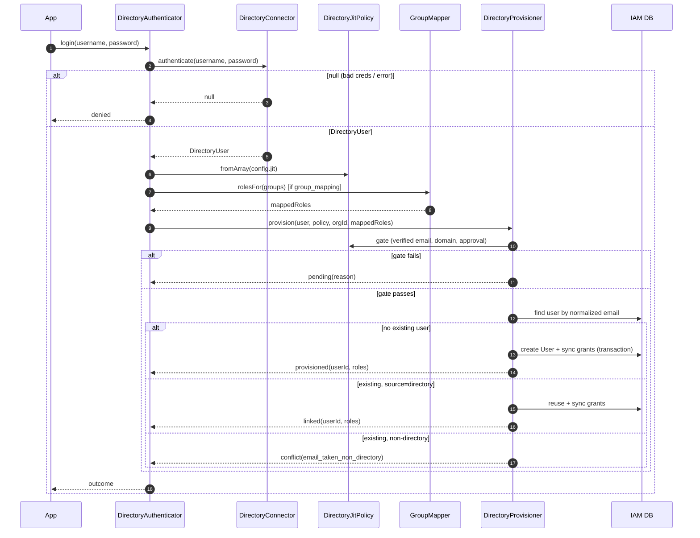

# Login pipeline

## Motivation

`DirectoryAuthenticator::login()` looks like one call, but it's a pipeline with several short-circuits, each
of which is a security decision. This page traces every branch so you can reason about exactly what runs —
and what *doesn't* — for each outcome.

## The full sequence



## Step by step

::: steps
1. **`DirectoryAuthenticator::login()`** — calls the connector. A `null` return becomes
   `DirectoryOutcome::denied()` immediately; no further step runs.
2. **Policy build** — `DirectoryJitPolicy::fromArray($config['jit'])` turns the config array into a typed,
   `final readonly` policy.
3. **Group mapping** — if `policy->groupMapping` is true, `GroupMapper::rolesFor($user->groups)` produces the
   mapped roles; otherwise the mapped set is empty.
4. **`DirectoryProvisioner::provision()`** — the rest happens here:
   the policy gate, the email lookup, the anti-takeover branch, the transactional create, and the
   authoritative grant sync.
:::

`login()` and `sync()` share steps 2–4. `sync(DirectoryUser)` skips step 1 (no credentials) — it's the
administrative path for an already-resolved user.

## The short-circuits, and what they skip

| Outcome | Decided at | What never runs |
|---|---|---|
| `denied` | step 1 (connector returns `null`) | policy, mapping, DB — nothing is touched |
| `pending` | provisioner policy gate | email lookup, user create, grant sync |
| `conflict` | provisioner, after email lookup | user create, grant sync (membership untouched) |
| `provisioned` | provisioner, no existing user | — (creates user + syncs grants in a transaction) |
| `linked` | provisioner, directory-sourced user | user create (reuses existing) |

::: callout tip "Read the table as a fail-closed ladder"
Each row stops earlier than the next "success" row. The further a request gets, the more it must have
*explicitly* satisfied — credentials, then policy, then identity ownership — before anything is written.
:::

## Configuration read at each step

`DirectoryAuthenticator` pulls two things from the `iam-directory` config section:

- **`jit`** → the policy (verified-email, domain allowlist, approval, default/protected roles, group-mapping flag).
- **`organization_id`** → the provisioning scope; `null` means a global user with no membership and no grants.

`group_map` is read once at boot into the `GroupMapper` singleton (see [Architecture overview](/architecture/overview)).

## Worked trace — a first login

```text
login("jdoe", "•••")
  → connector.authenticate → DirectoryUser(jdoe, jdoe@acme.com, verified, groups=[developers])
  → policy = { require_verified_email: true, default_roles: [iam:tenant_member], group_mapping: true,
               protected_roles: [iam:super_admin] }
  → mapper.rolesFor([developers]) → [app:deployer, app:developer]
  → provision(...)
      gate: verified ✓, domain ✓, approval ✗(not required) → pass
      email lookup: jdoe@acme.com → none
      create User → sync grants:
        wanted = (default ∪ mapped) − protected = [iam:tenant_member, app:deployer, app:developer]
        membership (source=directory) created; 3 grants inserted
  → provisioned("user_…", [iam:tenant_member, app:deployer, app:developer])
```

## Related

- [Directory login](/guides/directory-login) — the caller's view and a controller example.
- [JIT provisioning & sync](/guides/jit-and-sync) — step 4 in full.
- [Outcomes & reasons](/reference/outcomes) — every terminal status.
