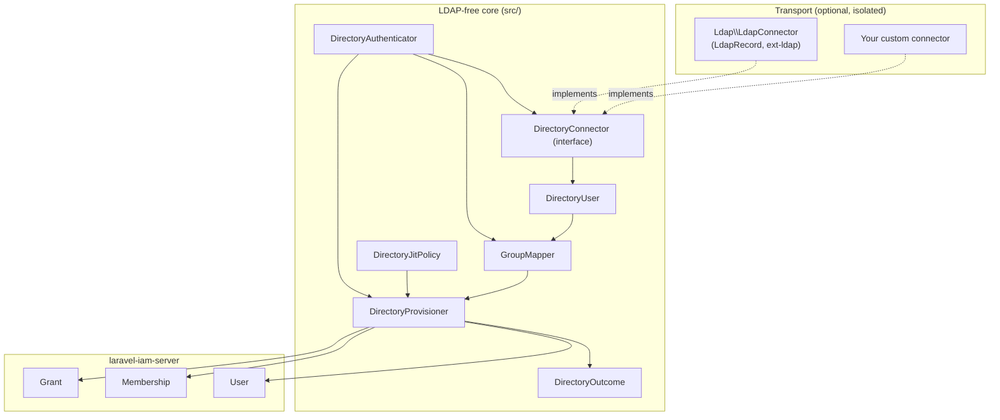

# Architecture overview

## The shape of the module

`laravel-iam-directory` is a thin, security-focused layer between a directory and the
[Laravel IAM server](https://doc.laravel-iam-server.padosoft.com). It is organized around one idea: **keep
the security-critical core free of LDAP**, so it installs, analyses and tests without `ext-ldap`.



## Layers

::: grids
  ::: grid
    ::: card "Transport (optional)" icon:plug
    `Ldap\LdapConnector` is the **only** class coupled to LdapRecord/`ext-ldap`. It lives under `src/Ldap/`,
    is excluded from PHPStan, and ships behind a `suggest`. A custom connector is an equal citizen here.
    :::
  :::
  ::: grid
    ::: card "Core (LDAP-free)" icon:box
    `DirectoryConnector`, `DirectoryUser`, `GroupMapper`, `DirectoryJitPolicy`, `DirectoryProvisioner`,
    `DirectoryOutcome`, `DirectoryAuthenticator`. No `ext-ldap` dependency; fully unit-testable.
    :::
  :::
  ::: grid
    ::: card "Server boundary" icon:database
    The provisioner writes through the IAM server's Eloquent models — `User`, `Membership`, `Grant`. The
    module runs *inside* the server app; it doesn't call the Admin API.
    :::
  :::
:::

## File layout

```
src/
  Contracts/
    DirectoryConnector.php      # the transport seam (interface)
  DirectoryUser.php            # normalized identity (final readonly)
  GroupMapper.php              # groups → roles (full_key)
  DirectoryJitPolicy.php       # secure-by-default policy (final readonly)
  DirectoryProvisioner.php     # JIT + authoritative sync — invariants live here
  DirectoryOutcome.php         # typed result (final readonly)
  DirectoryAuthenticator.php   # orchestrator: authenticate → map → provision
  IamDirectoryServiceProvider.php
  Ldap/
    LdapConnector.php          # optional LDAP/AD transport (excluded from PHPStan)
config/
  iam-directory.php            # organization_id, jit{…}, group_map{…}
```

## Dependency injection

`IamDirectoryServiceProvider` registers three singletons and leaves the connector to the app:

| Binding | Resolved from |
|---|---|
| `GroupMapper` | `config('iam-directory.group_map')` |
| `DirectoryProvisioner` | auto-resolved (no dependencies on config) |
| `DirectoryAuthenticator` | `DirectoryConnector` (**you bind**) + `GroupMapper` + `DirectoryProvisioner` + `config('iam-directory')` |

::: callout warning "DirectoryConnector is intentionally unbound"
There's no default connector — LDAP is optional and a custom source is app-specific. Bind one in your
`AppServiceProvider`, or `DirectoryAuthenticator` can't be constructed.
:::

## Boundaries and responsibilities

- **The connector** produces identity. It decides *who the user is*, never *what they get*.
- **The mapper** translates groups → roles. Pure, deterministic, default-deny.
- **The policy** gates provisioning. Secure-by-default, evaluated before any write.
- **The provisioner** owns every security invariant — anti-takeover, authoritative sync, protected roles,
  transactional creation. This is the one place to audit.
- **The IAM server** owns authorization at runtime. The module grants *roles*; the
  [PDP](https://doc.laravel-iam-server.padosoft.com) decides allow/deny.

## Where to go next

- [Login pipeline](/architecture/login-pipeline) — the full request sequence.
- [Data model & contract](/architecture/data-model) — exactly what gets written.
- [ADR — decisions](/architecture/decisions) — why it's built this way.
