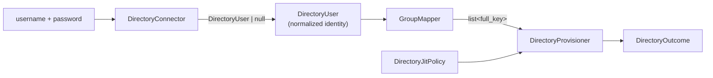

# Core concepts

## Motivation

Your identities live in LDAP/Active Directory, but your authorization lives in
[Laravel IAM](https://doc.laravel-iam-server.padosoft.com). You need to let directory users log in, create
their IAM accounts on demand, and keep their roles aligned with their directory groups — **without** opening
the three holes that naive sync code opens: account **takeover**, **stale privileges**, and group-mapping
**escalation**.

This module is a small, deliberately strict pipeline that does exactly that, with every security invariant
in one place.

## The mental model

The module is a pipeline, decoupled from the transport at the very first step:



Everything downstream of `DirectoryConnector` works on a **normalized `DirectoryUser`** — so the core never
depends on LDAP types and is trivially testable.

## Core entities

::: grids
  ::: grid
    ::: card "DirectoryConnector" icon:plug
    The transport seam. `authenticate(user, pass): ?DirectoryUser` and `find(user): ?DirectoryUser`. Returns
    `null` (= denied / not found) on failure — **never** an opaque exception. The LDAP/AD implementation
    (`Ldap\LdapConnector`) is optional; any custom source can implement it.
    :::
  :::
  ::: grid
    ::: card "DirectoryUser" icon:user
    A `final readonly` normalized identity: `username`, `email`, `emailVerified`, `displayName`, and
    `groups` (DN **or** short CN). Helpers `normalizedEmail()` / `emailDomain()`.
    :::
  :::
  ::: grid
    ::: card "GroupMapper" icon:list-tree
    Translates the user's `groups` into IAM roles (`full_key`), matching DN and CN case-insensitively.
    Unmapped groups are ignored — **default-deny**, no implicit roles.
    :::
  :::
  ::: grid
    ::: card "DirectoryJitPolicy" icon:shield
    Secure-by-default policy: `requireVerifiedEmail`, `allowedDomains`, `approvalRequired`, `defaultRoles`,
    `groupMapping`, and `protectedRoles` (roles the directory may never grant).
    :::
  :::
  ::: grid
    ::: card "DirectoryProvisioner" icon:database
    Creates the user/membership/grants on first login and **re-syncs authoritatively** afterwards: adds
    missing roles, revokes stale directory-sourced ones, leaves manual grants alone.
    :::
  :::
  ::: grid
    ::: card "DirectoryOutcome" icon:flag
    The typed result: `provisioned` · `linked` · `conflict` · `pending` · `denied`, plus the `roles` granted
    in this pass.
    :::
  :::
:::

`DirectoryAuthenticator` is the orchestrator that strings these together: `login()` calls the connector,
maps groups, applies the policy and provisions — returning the outcome.

## Worked example

```php
use Padosoft\Iam\Directory\{DirectoryUser, GroupMapper, DirectoryJitPolicy};

$user = new DirectoryUser(
    username: 'jdoe',
    email: 'jdoe@acme.com',
    emailVerified: true,
    groups: ['developers'],
);

$roles = (new GroupMapper(['developers' => ['app:developer', 'app:deployer']]))
    ->rolesFor($user->groups);
// → ['app:deployer', 'app:developer']  (sorted, unique)

$policy = DirectoryJitPolicy::fromArray([
    'default_roles'   => ['iam:tenant_member'],
    'protected_roles' => ['iam:super_admin'],
]);

$outcome = $provisioner->provision($user, $policy, 'org_123', $roles);
// → DirectoryOutcome::provisioned('user_…', ['iam:tenant_member', 'app:developer', 'app:deployer'])
```

## The three anti-patterns this module forbids

::: callout danger "Don't auto-link by email"
Linking any account whose email matches the directory entry is an **account-takeover vector** — an attacker
who can set an email in LDAP inherits a local account. This module only reuses accounts already
`source=directory`; anything else is a `conflict` requiring a manual, verified link. → [Anti-takeover](/security/anti-takeover)
:::

::: callout danger "Don't leave roles behind"
If you only ever *add* roles, a user removed from an LDAP group keeps the privilege forever. The sync is
**authoritative**: it revokes directory-sourced roles no longer mapped. → [Authoritative sync](/security/authoritative-sync)
:::

::: callout danger "Don't trust group_map blindly"
A wrong or compromised `group_map` row must not be able to grant `iam:super_admin`. `protected_roles` are
filtered out of mapped roles — always manual-only. → [Protected roles](/security/protected-roles)
:::

## Why this design

::: collapsible "ADR — decouple the core from LDAP"
**Problem.** The security-critical logic (provisioning, sync, anti-takeover) must be testable and analysable,
but LDAP/`ext-ldap` is awkward to install in CI and Herd and impossible to unit-test without a server.

**Decision.** Introduce a `DirectoryConnector` seam returning a normalized `DirectoryUser`. Keep the only
LDAP-coupled class (`Ldap\LdapConnector`) under `src/Ldap/`, exclude it from PHPStan, and put LdapRecord in
`suggest`, not `require`.

**Consequences.** The core installs and passes static analysis without `ext-ldap`; the provisioning logic is
unit-tested against a fake connector; non-LDAP sources reuse the exact same hardened path. The cost is one
extra abstraction and the need to bind a connector explicitly.
:::

The security invariants live in **one place** — the provisioner — not scattered across every call site.
That's what makes them auditable and hard to bypass.

## Next steps

- [Architecture overview](/architecture/overview) — how the pieces are wired.
- [Login pipeline](/architecture/login-pipeline) — the full sequence with a diagram.
- [Data model & contract](/architecture/data-model) — what gets written to IAM.
