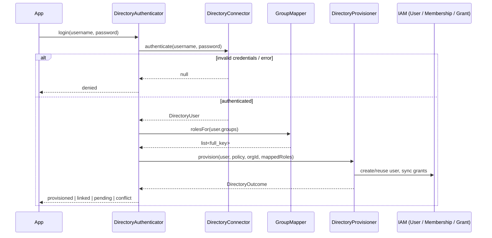

# Directory login

## Motivation

You want enterprise users to sign in with their **directory credentials** instead of (or alongside) a local
password, and you want their IAM account and roles to *just exist* and *stay correct* — without writing the
provisioning and sync logic yourself, and without the security holes that come with it.

`DirectoryAuthenticator` is the single entry point an app calls in place of the local guard for directory
users.

## The flow



## The single call

```php
use Padosoft\Iam\Directory\DirectoryAuthenticator;

$outcome = app(DirectoryAuthenticator::class)->login($username, $password);
```

Internally `login()`:

::: steps
1. **Authenticate** — `connector->authenticate($username, $password)`. `null` short-circuits to
   `DirectoryOutcome::denied()` — nothing else runs.
2. **Build the policy** — `DirectoryJitPolicy::fromArray($config['jit'])`.
3. **Map groups** — if `group_mapping` is enabled, `mapper->rolesFor($user->groups)`; otherwise no mapped
   roles.
4. **Provision / sync** — `provisioner->provision($user, $policy, $organizationId, $mappedRoles)`, which
   returns the final outcome.
:::

## Branch on the outcome

```php
match ($outcome->status) {
    'provisioned', 'linked' => Auth::loginUsingId($outcome->userId), // roles already synced
    'pending'  => back()->withErrors("Access pending: {$outcome->reason}"),
    'conflict' => back()->withErrors('That email belongs to an existing account — manual link required.'),
    'denied'   => back()->withErrors('Invalid credentials.'),
};
```

`provisioned` and `linked` both mean *success, you may log the user in*; `DirectoryOutcome::ok()` returns
`true` for exactly those two. The others are terminal refusals with a machine-readable `reason` (see
[Outcomes & reasons](/reference/outcomes)).

::: callout tip "Roles are synced before you log in"
By the time `login()` returns `provisioned`/`linked`, the user's directory-sourced grants already match
their current groups. You don't run a separate sync step — the login *is* the sync.
:::

## Administrative sync (no credentials)

Sometimes you already have a resolved `DirectoryUser` (e.g. from a scheduled job that lists the directory)
and want to re-sync roles **without** a password. Use `sync()`:

```php
$user = $connector->find('jdoe');          // no-credentials lookup
if ($user !== null) {
    $outcome = app(DirectoryAuthenticator::class)->sync($user);
}
```

`sync()` skips authentication and runs map → policy → provision directly. It's the same path `login()` uses
after a successful bind, so all the same invariants apply.

::: callout warning "find() returns identity, not authorization"
`find()` does **not** verify credentials — it's a lookup. Only call `sync()` with a `DirectoryUser` you
trust (e.g. one you just enumerated from the directory as an admin), never one built from unauthenticated
user input.
:::

## Worked example — a login controller

```php
final class DirectoryLoginController
{
    public function store(Request $request, DirectoryAuthenticator $auth): RedirectResponse
    {
        $data = $request->validate([
            'username' => ['required', 'string'],
            'password' => ['required', 'string'],
        ]);

        $outcome = $auth->login($data['username'], $data['password']);

        if ($outcome->ok()) {
            Auth::loginUsingId($outcome->userId);

            return redirect()->intended('/dashboard');
        }

        return back()->withErrors([
            'username' => match ($outcome->status) {
                'pending'  => __("Access pending approval ({$outcome->reason})."),
                'conflict' => __('That email is already in use — contact an administrator to link it.'),
                default    => __('Invalid directory credentials.'),
            },
        ]);
    }
}
```

## Gotchas

::: callout warning "No organization → no roles"
If `organization_id` is `null`, provisioning creates/identifies the user but grants **nothing** — grants are
scoped to a membership, and there's no membership for a global user. You still get `provisioned`/`linked`,
just with an empty `roles` array. Set the target org to grant roles.
:::

## Related

- [Group → role mapping](/guides/group-mapping) — how `groups` become roles.
- [JIT provisioning & sync](/guides/jit-and-sync) — what `provision()` actually writes.
- [Outcomes & reasons](/reference/outcomes) — every status and `reason` string.
