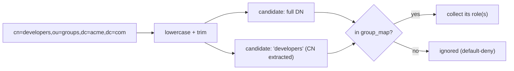

# Group → role mapping

## Motivation

A directory tells you which **groups** a user belongs to. IAM authorizes on **roles** (`full_key`). The
mapping between the two is the one place where a mistake is dangerous: map the wrong group to an admin role
and you've granted admin to everyone in it. `GroupMapper` makes that mapping explicit, deterministic, and
**default-deny**.

## The map

You declare the mapping in `config/iam-directory.php` under `group_map`:

```php
'group_map' => [
    'cn=warehouse-admins,ou=groups,dc=acme,dc=com' => 'warehouse:admin',   // single role
    'developers' => ['app:developer', 'app:deployer'],                     // list of roles
],
```

- **Key** = a directory group, written as the **full DN** *or* the **short CN**.
- **Value** = a single role `full_key`, or a list of them.

## DN and CN, case-insensitively

Directories expose group membership in different forms: Active Directory's `memberOf` yields **full DNs**
(`cn=developers,ou=groups,dc=acme,dc=com`), while other sources hand you bare **CNs** (`developers`).
`GroupMapper` accepts either, so your map keeps working regardless of the form your connector produces.

For each of the user's groups it builds the candidate keys to look up:



Concretely, given `cn=developers,ou=groups,dc=acme,dc=com`, the mapper looks up **both**
`cn=developers,ou=groups,dc=acme,dc=com` and `developers` — so a `group_map` keyed by either form matches.
All comparisons are lowercased and trimmed on both sides.

::: callout tip "CN extraction is the leftmost RDN only"
The CN candidate is extracted with `^cn=([^,]+)` — the first `cn=` component of the DN. Nested or multi-valued
RDNs aren't decomposed further; if your directory uses an unusual naming attribute, key the map by the full
DN it actually emits.
:::

## Single role or a list

A value may be a string or an array; both normalize to a list internally:

```php
'sysadmins'  => 'infra:admin',                       // → ['infra:admin']
'developers' => ['app:developer', 'app:deployer'],   // → ['app:developer', 'app:deployer']
```

Empty strings and non-string entries are filtered out during normalization, so a stray `null` or `''` in the
config can't produce a bogus role.

## Deterministic, unique output

`rolesFor()` collects roles across all of the user's groups, **de-duplicates** them, and returns them
**sorted** — so the result is stable regardless of group order:

```php
$mapper = new GroupMapper([
    'developers' => ['app:developer', 'app:deployer'],
    'oncall'     => 'app:deployer',          // overlaps deliberately
]);

$mapper->rolesFor(['oncall', 'developers']);
// → ['app:deployer', 'app:developer']   (unique + sorted)
```

Deterministic output matters: it makes the [authoritative sync](/security/authoritative-sync) idempotent and
makes test assertions stable.

## Default-deny

A group that isn't in `group_map` contributes **no roles** — there are no implicit or fallback roles:

```php
$mapper->rolesFor(['some-unmapped-group']);
// → []
```

::: callout warning "Mapping assigns roles, not permissions"
The values are IAM **role** `full_key`s (e.g. `warehouse:admin`), resolved by the IAM server against your
application manifests. This module never invents permissions — it grants roles, and the
[PDP](https://doc.laravel-iam-server.padosoft.com) decides what those roles can do.
:::

## Where mapping sits in the pipeline

`DirectoryAuthenticator` only calls the mapper when the policy's `group_mapping` flag is on. The mapped roles
are then unioned with `default_roles` and have `protected_roles` subtracted, inside the provisioner — see
[JIT provisioning & sync](/guides/jit-and-sync) and [Protected roles](/security/protected-roles).

## Gotchas

- **Map by the form your connector emits.** The built-in `Ldap\LdapConnector` reads `memberOf` and produces
  **DNs**. If you key your map by CN only, the DN candidate won't match — but the extracted CN will, so it
  still works. Keep this in mind when debugging a "role not granted" case.
- **`group_mapping: false` disables the whole map.** With that flag off, only `default_roles` are granted.

## Related

- [Protected roles](/security/protected-roles) — roles the map can never grant.
- [Custom connector](/guides/custom-connector) — controlling the `groups` you feed the mapper.
- [PHP API → GroupMapper](/reference/php-api) — the exact signatures.
