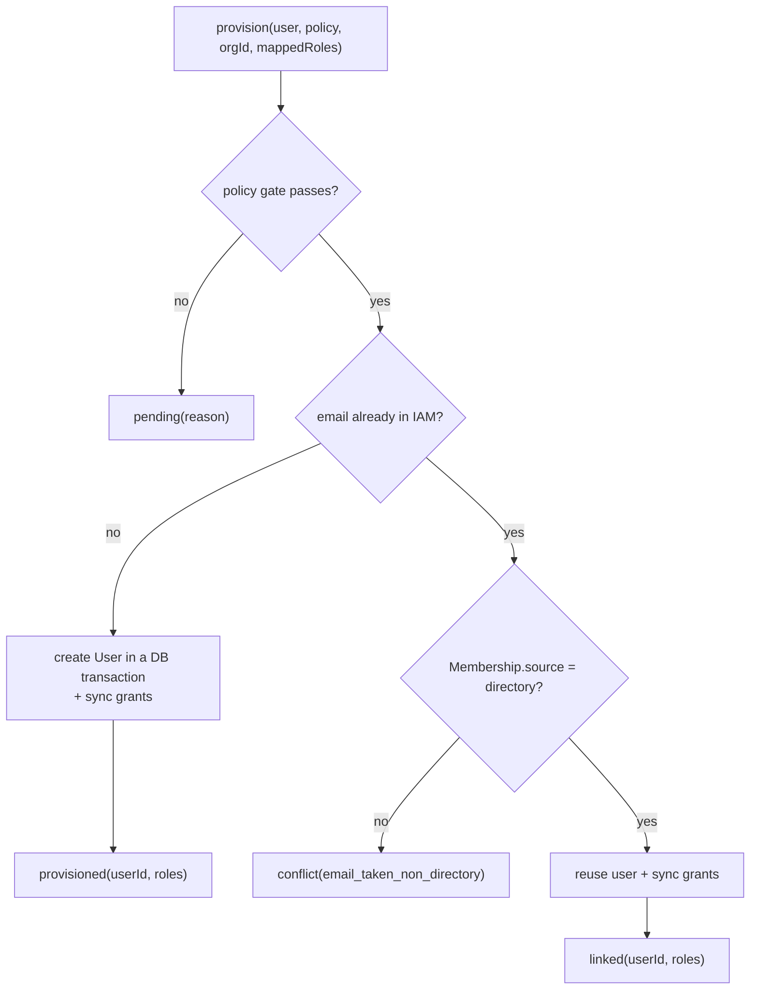

# JIT provisioning & sync

## Motivation

When a directory user logs in for the first time, their IAM account doesn't exist yet. **Just-In-Time (JIT)
provisioning** creates it on the spot — user, membership, and the right roles — so there's no manual
onboarding. On every login afterwards, the same code **re-syncs** their roles so privileges never drift from
the directory. `DirectoryProvisioner` is where both happen, and where every security invariant lives.

## The policy gate first

Before anything is created, `DirectoryJitPolicy` is evaluated **in order**. Any failed check returns
`DirectoryOutcome::pending(reason)` — never a partial provisioning:

::: steps
1. **Verified email** — if `require_verified_email` and the user's email isn't verified →
   `pending: jit_requires_verified_email`.
2. **Domain allowlist** — if `allowed_domains` is non-empty and the email's domain isn't in it →
   `pending: jit_domain_not_allowed`.
3. **Approval** — if `approval_required` → `pending: jit_approval_required` (a human approves out-of-band).
:::

Only after all three pass does the provisioner compute roles and touch the database.

## Computing the roles to grant

`rolesToGrant()` builds the effective role set:

$$\text{effective} = \bigl(\text{default\_roles} \cup \text{mapped\_roles}\bigr) \setminus \text{protected\_roles}$$

- `default_roles` — bootstrap roles every provisioned user gets.
- `mapped_roles` — from `GroupMapper`, only if `group_mapping` is on.
- `protected_roles` — **subtracted** from the mapped set, so the directory can never grant them (see
  [Protected roles](/security/protected-roles)).

The result is de-duplicated. `default_roles` are *not* filtered by `protected_roles` — they're an explicit
operator choice, not directory-sourced.

## First login vs. subsequent logins



- **No existing user** → create `User` (`email`, `name`, `email_verified_at`) inside a `DB::transaction`,
  then sync grants → `provisioned`.
- **Existing directory-sourced user** → reuse it, re-sync grants → `linked`.
- **Existing non-directory user** → `conflict`, nothing written (see [Anti-takeover](/security/anti-takeover)).

## The authoritative sync

`sync()` makes the user's **directory-sourced** grants match the current mapped roles, scoped to the
organization:

::: steps
1. **Ensure membership** — `Membership::firstOrCreate` with `source = directory`, `joined_at = now()`.
2. **Revoke stale roles** — load active grants where `source = directory`, `privilege_type = role`,
   `revoked_at IS NULL`; for any whose `privilege_key` is no longer wanted, call `revoke('directory_sync_removed')`.
3. **Add missing roles** — for each wanted role without an active matching grant, create a `Grant`
   (`source = directory`, `valid_from = now()`).
:::

```php
// Conceptually, after sync(), for this (org, user):
//   active directory grants  ==  wanted roles
//   manual grants (source ≠ directory)  ==  untouched
```

::: callout warning "Sync only runs with an organization"
If `organization_id` is `null`, `sync()` returns early — a global user has no membership to scope grants to.
You still get `provisioned`/`linked`, but with no grants. Configure the target org to actually grant roles.
:::

## Idempotency

Re-running with the same groups is a no-op on the data:

- a role that's already actively granted is **not** re-created (existence check before insert);
- a role that's still wanted is **not** revoked;
- only *changes* in directory membership produce writes (a new grant, or a revoke).

So logging in twice in a row grants nothing the second time — there are no duplicate grants.

## Worked example — a promotion and a demotion

```php
// Day 1: jdoe is in 'developers' → ['app:developer', 'app:deployer']
$provisioner->provision($jdoe, $policy, 'org_123', ['app:developer', 'app:deployer']);
// → provisioned, grants: app:developer, app:deployer (source=directory)

// Day 30: jdoe added to 'warehouse-admins', still in 'developers'
$provisioner->provision($jdoe, $policy, 'org_123', ['app:developer', 'app:deployer', 'warehouse:admin']);
// → linked, adds warehouse:admin; the two existing grants are left as-is

// Day 60: jdoe removed from 'developers', still 'warehouse-admins'
$provisioner->provision($jdoe, $policy, 'org_123', ['warehouse:admin']);
// → linked, REVOKES app:developer + app:deployer (reason directory_sync_removed); warehouse:admin stays
```

Throughout, any role an admin granted manually (`source ≠ directory`) is never touched.

## Related

- [Authoritative sync](/security/authoritative-sync) — the revocation invariant in depth.
- [Anti-takeover](/security/anti-takeover) — the email-collision rule.
- [Protected roles](/security/protected-roles) — the subtraction step.
- [Data model & contract](/architecture/data-model) — the exact columns written.
