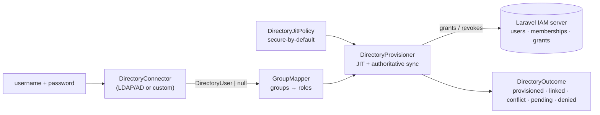

# laravel-iam-directory

> **`padosoft/laravel-iam-directory` lets enterprise users sign in with the credentials they already have in
> LDAP or Active Directory, provisions their IAM account on first login, and keeps their roles in lock-step
> with their directory groups — while refusing every classic identity-sync trap by design.**
> An optional module of [Laravel IAM](https://doc.laravel-iam-server.padosoft.com): the LDAP transport is
> isolated and optional, so the security-critical core installs, analyses and tests **without `ext-ldap`**.

::: callout info "New here? Read this page top to bottom" icon:compass
In a few minutes you'll know exactly what this module is, the three pitfalls it closes, why its core is
LDAP-free, and where to click next. Every other page goes deeper — this one gives you the whole picture.
:::

---

## What it is — in one minute

Most teams already keep their users in **LDAP or Active Directory**. Wiring that into an app usually means
one of two bad outcomes: a brittle hand-rolled bind that silently **fails open**, or a "sync everything"
job that happily **takes over local accounts**, **keeps stale privileges forever**, and lets a single wrong
row in a group-mapping table **escalate a user to admin**.

`laravel-iam-directory` is the **optional Directory module** of the Laravel IAM family. It does three
things, and closes a pitfall with each:

- **Authenticates** enterprise users against your directory — fail-closed: bad credentials or a connector
  error resolve to *denied*, never a half-provisioned user.
- **Provisions** an IAM user + membership + roles **Just-In-Time** on first login — anti-takeover: an email
  already owned by a *non-directory* account is never auto-linked.
- **Maps** the user's directory groups to IAM roles and **re-syncs authoritatively** on every login — no
  privilege persistence: drop a user from an LDAP group and the matching role is **revoked**; `protected_roles`
  can never be granted by the directory.

> **In one line:** *the shortest path from "our users are in AD" to "they log into Laravel IAM with the
> right roles — and only the right roles, kept honest on every login".*

---

## The problem it solves

| Naive directory sync | laravel-iam-directory |
|---|---|
| A matching email is auto-linked → anyone who can set an email in LDAP inherits a local account. | An email owned by a non-directory account → **`conflict`**, never a silent takeover. |
| Roles are only ever *added* → a user removed from a group keeps the privilege forever. | The sync is **authoritative**: directory-sourced roles no longer mapped are **revoked**. |
| One wrong row in the group map grants `super_admin`. | `protected_roles` are filtered out of mapping — **manual-assignment only**. |
| A bind error throws, and a `catch` quietly lets the user in. | `null` from the connector → **`denied`**. Errors never fail open. |
| The whole package needs `ext-ldap`, so CI and Herd can't install it. | The core is **LDAP-free**; the real connector is an isolated, optional `suggest`. |

---

## Who it's for

::: grids
  ::: grid
    ::: card "Enterprises without an IdP" icon:building
    You have AD/LDAP but no SAML/OIDC identity provider. Let users sign in with their directory credentials,
    without standing up a full federation stack.
    :::
  :::
  ::: grid
    ::: card "Platform & security teams" icon:shield
    You need provisioning that is *secure by default*: no account takeover, no stale privileges, no
    group-map escalation — invariants enforced in one place, not scattered across call sites.
    :::
  :::
  ::: grid
    ::: card "App developers" icon:code
    You want directory login wired into a [Laravel IAM server](https://doc.laravel-iam-server.padosoft.com)
    with a single `login()` call and a typed outcome to branch on.
    :::
  :::
  ::: grid
    ::: card "Teams with a non-LDAP source" icon:plug
    Your identities live in a CSV, an HR API or a legacy DB. Implement one interface and reuse the exact same
    hardened JIT/sync path — no `ext-ldap` required.
    :::
  :::
:::

---

## Why it's different — the moats

::: grids
  ::: grid
    ::: card "LDAP-free core" icon:box
    Every security rule runs on a normalized `DirectoryUser` produced by a `DirectoryConnector`. The core
    installs, passes PHPStan and is unit-tested **without `ext-ldap`**; the real transport is isolated under
    `src/Ldap/`.
    :::
  :::
  ::: grid
    ::: card "Authoritative sync, not append-only" icon:rotate-ccw
    On every login the provisioner makes directory-sourced grants *match* the current mapped roles — adding
    missing, **revoking stale**, never touching manual grants.
    :::
  :::
  ::: grid
    ::: card "Anti-takeover by construction" icon:user-x
    Only an account the directory already provisioned (`Membership.source = directory`) is reused. Any other
    email collision is a `conflict` requiring a verified manual link.
    :::
  :::
  ::: grid
    ::: card "Protected roles" icon:lock
    List the roles (e.g. `iam:super_admin`) the directory may **never** grant. A compromised or mistyped
    `group_map` row simply can't escalate anyone.
    :::
  :::
:::

---

## How it fits together

A connector turns directory credentials into a normalized `DirectoryUser`; the mapper turns its groups into
IAM roles; the provisioner applies a secure-by-default JIT policy and an authoritative sync, returning a
typed `DirectoryOutcome`. The directory assigns **roles** — the [PDP](https://doc.laravel-iam-server.padosoft.com),
not this module, decides allow/deny.



---

## Start in 60 seconds

::: steps
1. **Install the package**
   ```bash
   composer require padosoft/laravel-iam-directory
   php artisan vendor:publish --tag=iam-directory-config
   ```
   The service provider registers the `GroupMapper`, `DirectoryProvisioner` and `DirectoryAuthenticator`.
   The real LDAP connector is **not** wired by default — it's an optional `suggest`.

2. **Map your groups to roles** in `config/iam-directory.php`
   ```php
   'group_map' => [
       'cn=warehouse-admins,ou=groups,dc=acme,dc=com' => 'warehouse:admin',
       'developers' => ['app:developer', 'app:deployer'],
   ],
   ```

3. **Authenticate and branch on the typed outcome**
   ```php
   use Padosoft\Iam\Directory\DirectoryAuthenticator;

   $outcome = app(DirectoryAuthenticator::class)->login($username, $password);

   match ($outcome->status) {
       'provisioned', 'linked' => Auth::loginUsingId($outcome->userId), // roles already synced
       'pending'  => back()->withErrors("Access pending: {$outcome->reason}"),
       'conflict' => back()->withErrors('Email belongs to an existing account — manual link required.'),
       'denied'   => back()->withErrors('Invalid credentials.'),
   };
   ```
:::

**[→ Quickstart](/quickstart)** · **[→ Installation](/installation)** · **[→ Core concepts](/concepts)**

---

## Ecosystem

`laravel-iam-directory` is the **optional Directory module** of the Laravel IAM family. The consumable
packages:

| Package | Role |
|---|---|
| [laravel-iam-contracts](https://doc.laravel-iam-contracts.padosoft.com) | Shared interfaces & DTOs (PDP, KeyProvider, Assurance, FeatureScope) — the dependency root |
| [laravel-iam-server](https://doc.laravel-iam-server.padosoft.com) | The control plane: identity, PDP, OAuth/OIDC, audit, governance, Admin API & panel |
| [laravel-iam-client](https://doc.laravel-iam-client.padosoft.com) | Client for consuming apps: OIDC login, JWT/JWKS, `iam.can` middleware, Gate adapter |
| [laravel-iam-ai](https://doc.laravel-iam-ai.padosoft.com) | Optional AI module: advisory-only governance (redaction + hallucination guard + audit) |
| **laravel-iam-directory** *(this repo)* | Optional directory module: LDAP / Active Directory (LdapRecord); SCIM in v2 |
| [laravel-iam-bridge-spatie-permission](https://doc.laravel-iam-bridge-spatie-permission.padosoft.com) | Migration bridge from spatie/laravel-permission: scan, shadow mode, cutover, rollback |
| [laravel-iam-node](https://doc.laravel-iam-node.padosoft.com) | Node/TS client SDK — thin + fail-closed |
| [laravel-iam-react-native](https://doc.laravel-iam-react-native.padosoft.com) | React Native client SDK — thin + hooks |
| [laravel-iam-rust](https://doc.laravel-iam-rust.padosoft.com) | Rust client SDK — async + blocking, fail-closed |

::: callout tip "Package facts" icon:info
Composer `padosoft/laravel-iam-directory` · PHP `^8.3` · Laravel 13 · LDAP transport `directorytree/ldaprecord-laravel`
(optional, needs `ext-ldap`) · MIT ·
[GitHub](https://github.com/padosoft/laravel-iam-directory) ·
[Packagist](https://packagist.org/packages/padosoft/laravel-iam-directory)
:::
