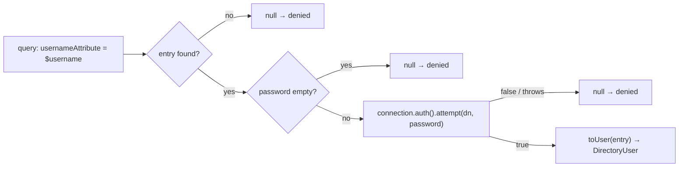

# LDAP / Active Directory setup

The LDAP/Active Directory transport is **optional**. The core (group mapping + JIT + sync) runs against any
`DirectoryConnector`; the built-in `Ldap\LdapConnector` is only needed when you want to bind against a real
directory.

::: callout warning "ext-ldap is required for the real connector"
`Ldap\LdapConnector` depends on PHP's `ext-ldap` and `directorytree/ldaprecord-laravel`. Both are kept in
`suggest` (not `require`) so the package installs and analyses cleanly where `ext-ldap` is absent (CI, Herd).
The connector is deliberately isolated under `src/Ldap/` and excluded from static analysis. If you don't have
`ext-ldap`, use a [custom connector](/guides/custom-connector) instead.
:::

## Enable it

::: steps
1. **Install the extension** — ensure `ext-ldap` is enabled in your PHP build:
   ```bash
   php -m | grep ldap
   ```
2. **Require LdapRecord**
   ```bash
   composer require directorytree/ldaprecord-laravel
   ```
3. **Configure the connection** — follow LdapRecord's connection config (host, base DN, bind user/password,
   port/TLS). This produces an `LdapRecord\Connection` and a `Model` class (e.g.
   `LdapRecord\Models\ActiveDirectory\User`).
4. **Bind `Ldap\LdapConnector`** as the module's `DirectoryConnector` (next section).
5. **Map groups → roles** — fill `group_map` in `config/iam-directory.php` with the DNs or CNs your directory
   exposes (see [Group → role mapping](/guides/group-mapping)).
:::

## Bind the connector

`Ldap\LdapConnector` takes the LdapRecord connection, the model class, and the username search attribute:

```php
use LdapRecord\Connection;
use LdapRecord\Models\ActiveDirectory\User as AdUser;
use Padosoft\Iam\Directory\Contracts\DirectoryConnector;
use Padosoft\Iam\Directory\Ldap\LdapConnector;

$this->app->bind(DirectoryConnector::class, function () {
    return new LdapConnector(
        connection: app(Connection::class),         // your configured LdapRecord connection
        model: AdUser::class,                       // class-string<LdapRecord\Models\Model>
        usernameAttribute: 'samaccountname',        // 'samaccountname' (AD) | 'uid' (OpenLDAP)
    );
});
```

| Constructor arg | Purpose |
|---|---|
| `connection` | A configured `LdapRecord\Connection` (host, base DN, bind credentials) |
| `model` | The LdapRecord model class to query |
| `usernameAttribute` | Search attribute — `samaccountname` for AD, `uid` for OpenLDAP (default `samaccountname`) |

## How it authenticates

`authenticate()` queries the model by `usernameAttribute`, then performs a **bind** with the entry's DN and
the supplied password:



Every failure mode — unknown user, empty password, rejected bind, transport exception — collapses to `null`.
That's the [fail-closed](/security/fail-closed) contract.

## Attribute mapping

`toUser()` maps LDAP attributes onto the normalized `DirectoryUser`:

| `DirectoryUser` field | LDAP attribute | Notes |
|---|---|---|
| `username` | `usernameAttribute` (e.g. `samaccountname`) | Falls back to the entry DN if absent |
| `email` | `mail` | First value if multi-valued |
| `displayName` | `cn` | First value if multi-valued |
| `groups` | `memberof` | All values, as **full DNs** |
| `emailVerified` | — | `true` when `mail` is present (enterprise directory email is treated as verified) |

::: callout warning "memberOf yields DNs — key your map accordingly (or rely on CN extraction)"
The connector emits group **DNs** from `memberof`. `GroupMapper` also tries the extracted CN, so a `group_map`
keyed by either form matches. If a role isn't being granted, confirm the DN the directory actually returns —
nested/primary-group memberships sometimes don't appear in `memberof`.
:::

## Lookups without credentials

`find($username)` runs the same query but skips the bind — used by administrative
[`sync()`](/guides/directory-login#administrative-sync-no-credentials) and your own enumeration jobs. It
returns a `DirectoryUser` (identity only) or `null`.

## No ext-ldap? Use a custom connector

Any class implementing `DirectoryConnector` plugs into the same hardened path. See
[Custom (non-LDAP) connector](/guides/custom-connector) for a worked HR-API example and a test double.

## Related

- [Configuration](/operations/configuration) — the policy and mapping knobs.
- [Troubleshooting](/operations/troubleshooting) — "role not granted", "everyone pending", binding errors.
- [Fail-closed transport](/security/fail-closed) — why every error becomes `denied`.
