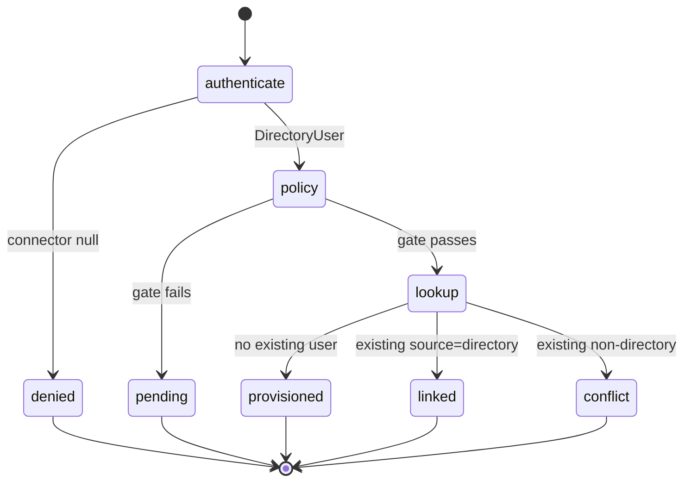

# Outcomes & reasons

`DirectoryAuthenticator::login()` and `sync()` return a `final readonly DirectoryOutcome`. There are exactly
five statuses; only two are "allow".

## Status taxonomy

| `status` | `ok()` | `userId` | `reason` | `roles` | Meaning |
|---|---|---|---|---|---|
| `provisioned` | ✅ | set | `null` | granted | New IAM user created (first login) |
| `linked` | ✅ | set | `null` | granted | Existing **directory-sourced** user reused, roles re-synced |
| `pending` | ❌ | `null` | set | `[]` | JIT policy blocked it — actionable, retryable |
| `conflict` | ❌ | `null` | set | `[]` | Email owned by a **non-directory** account — no takeover |
| `denied` | ❌ | `null` | set | `[]` | Invalid credentials / connector error |

`ok()` returns `true` **iff** status is `provisioned` or `linked` — the only branch in which you should log the
user in.

## Reason strings

`reason` is machine-readable and stable. Treat it as an enum.

| `status` | `reason` | Cause | Where documented |
|---|---|---|---|
| `pending` | `jit_requires_verified_email` | `require_verified_email` on, email not verified | [JIT & sync](/guides/jit-and-sync) |
| `pending` | `jit_domain_not_allowed` | Email domain not in `allowed_domains` | [Configuration](/operations/configuration) |
| `pending` | `jit_approval_required` | `approval_required` on | [Configuration](/operations/configuration) |
| `conflict` | `email_taken_non_directory` | Email belongs to a non-directory account | [Anti-takeover](/security/anti-takeover) |
| `denied` | `invalid_credentials` | Connector returned `null` | [Fail-closed](/security/fail-closed) |

## Factory methods

```php
DirectoryOutcome::provisioned(string $userId, array $roles): self;
DirectoryOutcome::linked(string $userId, array $roles): self;
DirectoryOutcome::pending(string $reason): self;
DirectoryOutcome::conflict(string $reason): self;
DirectoryOutcome::denied(): self;                   // reason fixed to 'invalid_credentials'
```

The constructor is private — an outcome can only be built through these, so the invariants (which fields are
set for which status) always hold.

## Branching

::: tabs
== tab "Minimal"
```php
if ($outcome->ok()) {
    Auth::loginUsingId($outcome->userId);
} else {
    back()->withErrors(__('Sign-in failed.'));
}
```
== tab "Full"
```php
match ($outcome->status) {
    'provisioned', 'linked' => Auth::loginUsingId($outcome->userId),
    'pending'  => back()->withErrors("Access pending: {$outcome->reason}"),
    'conflict' => back()->withErrors('That email belongs to an existing account — manual link required.'),
    'denied'   => back()->withErrors('Invalid credentials.'),
};
```
== tab "By reason"
```php
$message = match ($outcome->reason) {
    'jit_requires_verified_email' => __('Please verify your email first.'),
    'jit_domain_not_allowed'      => __('Your email domain is not permitted.'),
    'jit_approval_required'       => __('Your access is awaiting approval.'),
    'email_taken_non_directory'   => __('That email is already in use — contact an administrator.'),
    'invalid_credentials'         => __('Invalid directory credentials.'),
    default                       => null,
};
```
:::

## State diagram



::: callout tip "pending is retryable; conflict and denied are not (by the user)"
A `pending` clears itself once the blocking condition is resolved (email verified, domain allowed, approval
granted) and the user logs in again. `conflict` needs an **administrator** to perform a verified link;
`denied` needs correct credentials.
:::

## Related

- [PHP API → DirectoryOutcome](/reference/php-api) — the type itself.
- [Directory login](/guides/directory-login) — branching in a controller.
- The security pages explain *why* each non-`ok` outcome exists.
