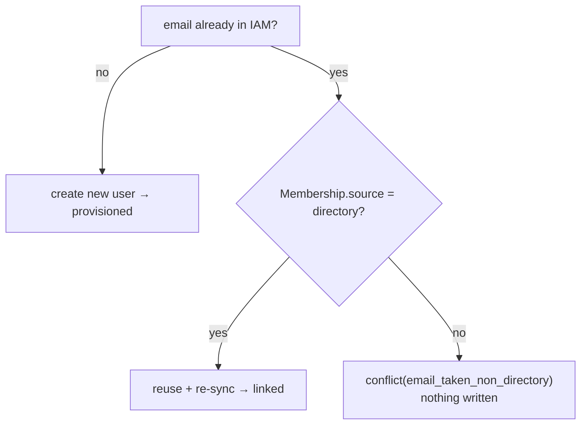

# Anti-takeover

## The threat

The naive way to "link" a directory user to an existing IAM account is: *if an account with this email
already exists, log them into it.* That is an **account-takeover vector**. Anyone who can set the `mail`
attribute on a directory entry — a help-desk operator, a self-service portal, an attacker who compromised one
LDAP account — can set it to `ceo@acme.com` and inherit the CEO's local account on next login.

::: callout danger "Email is an identifier, not a proof of ownership"
A directory controls *its own* accounts. It does **not** own the local/other accounts that happen to share an
email. Treating an email match as authorization to assume any account collapses that boundary.
:::

## The rule

`DirectoryProvisioner` reuses an existing account **only** when the directory already provisioned it —
verified by `isDirectorySourced()`, which checks for a `Membership` with `source = directory` (scoped to the
organization when one is configured):



| Existing account | Result | Why |
|---|---|---|
| None | `provisioned` | New user created in a transaction |
| `source = directory` | `linked` | The directory already owns this account — safe to reuse |
| `source ≠ directory` (local / other) | `conflict` | **No takeover** — a human must verify and link |

## The conflict outcome

A collision with a non-directory account yields:

```php
DirectoryOutcome::conflict('email_taken_non_directory');
// status = 'conflict', userId = null, reason = 'email_taken_non_directory'
```

Nothing is written. The caller surfaces this as "that email belongs to an existing account — manual link
required" and an administrator performs a **verified** link out-of-band (confirming the directory user really
is the owner of the local account) before that user can sign in via the directory.

::: callout warning "Resolve conflicts deliberately, never automatically"
Don't paper over a `conflict` by auto-creating a second account or by flipping the existing membership to
`source = directory` in code. Either re-introduces the takeover. The whole point is that a *human* asserts the
identities are the same.
:::

## Formal statement

Let $E$ be the candidate's normalized email and $A(E)$ the existing account with that email (if any). Reuse is
permitted **iff**:

$$A(E) \neq \varnothing \;\land\; \mathrm{source}\bigl(\mathrm{Membership}(A(E))\bigr) = \texttt{directory}$$

Otherwise the action is `provisioned` (when $A(E) = \varnothing$) or `conflict` (when $A(E)$ exists but is
not directory-sourced). There is no path from a non-directory account to a silent login.

## Worked example

```php
// A local account exists: alice@acme.com, registered via the normal signup form.
// The directory now reports a user whose mail is alice@acme.com.

$outcome = $provisioner->provision($aliceFromDirectory, $policy, 'org_123', $roles);
// → conflict('email_taken_non_directory')   — alice's local account is untouched

// Contrast: bob@acme.com was first seen through the directory (Membership.source=directory).
$outcome = $provisioner->provision($bobFromDirectory, $policy, 'org_123', $roles);
// → linked('user_bob', [...])               — safe, the directory already owns this account
```

## Don't regress this

The package's tests assert: *email collision with a non-directory account → `conflict` (not `linked`), and no
user/grant is created.* If you fork the provisioner, keep that test green.

## Related

- [Authoritative sync](/security/authoritative-sync) — what happens once a directory account *is* reused.
- [Fail-closed transport](/security/fail-closed) — the other half of "never fail open".
- [Outcomes & reasons](/reference/outcomes) — the full `conflict` reason vocabulary.
