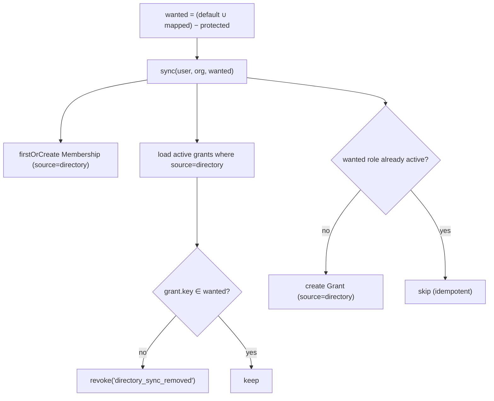

# Authoritative sync

## The threat: privilege persistence

The naive sync is **append-only**: on each login, add the roles the directory currently maps. The bug is what
it *doesn't* do — it never removes anything. So when a user changes teams, leaves a project, or is offboarded
from a group, their old privileges **persist forever**. Over time every long-tenured account accumulates
access nobody intended, and a role removal in the directory has no effect in IAM.

::: callout danger "Append-only sync is a least-privilege violation"
If membership in an LDAP group is what *grants* a role, then leaving that group must *revoke* it. Otherwise
the directory is no longer the source of truth — it can only ever add power, never take it away.
:::

## The rule: make grants match, don't just add

`DirectoryProvisioner::sync()` is **authoritative**: after it runs, the user's active **directory-sourced**
grants are exactly the currently wanted roles — no more, no less.



The two halves:

::: steps
1. **Revoke stale** — every active grant with `source = directory`, `privilege_type = role`,
   `revoked_at IS NULL` whose `privilege_key` is **not** in the wanted set is revoked with reason
   `directory_sync_removed`.
2. **Add missing** — every wanted role without an active matching grant gets a new `Grant`
   (`source = directory`, `valid_from = now()`).
:::

## Manual grants are sacred

The revocation is scoped to `source = directory`. Grants assigned by an administrator (any other `source`)
are **never** touched — neither added nor revoked by the sync:

```php
// alice has, in org_123:
//   role:warehouse:admin   source=directory   (from her LDAP group)
//   role:billing:auditor   source=manual      (granted by an admin)
//
// She's removed from the warehouse-admins group. Next login:
$provisioner->provision($alice, $policy, 'org_123', [/* no warehouse:admin */]);
//   warehouse:admin → REVOKED (directory_sync_removed)
//   billing:auditor → untouched (manual grants are preserved)
```

This separation is what lets the directory be authoritative over *its* roles without trampling deliberate,
human-made exceptions.

## Scope: roles live under a membership

`sync()` does nothing when `organization_id` is `null`. Grants are scoped to a `(organization, user)`
membership; a global user has none, so there's nothing to sync. You'll still get `provisioned`/`linked`, but
with an empty `roles` array. Set the target org to actually grant and revoke roles.

## Idempotency

Re-running with the same wanted set produces **zero** writes:

- an already-active wanted role is detected by an existence check and **not** re-inserted (no duplicate
  grants);
- a still-wanted role is **not** revoked.

Only an actual change in directory membership — a group added or removed — produces a write. So two
back-to-back logins leave the data identical after the first.

## Formal statement

Let $D$ be the set of active directory-sourced role keys for $(org, user)$ before sync, and $W$ the wanted
set. After `sync()`:

$$\text{revoked} = D \setminus W, \qquad \text{added} = W \setminus D, \qquad \text{active}_{\text{dir}} = W$$

Manual grants $M$ (with $\mathrm{source} \neq \texttt{directory}$) satisfy $M_{\text{after}} = M_{\text{before}}$.

## Don't regress this

The tests assert: *a user removed from a mapped group has the role **revoked** on next sync; a second login
is idempotent (no duplicate grants); manual grants survive.* Keep all three green.

## Related

- [JIT provisioning & sync](/guides/jit-and-sync) — the full provisioning flow this sits inside.
- [Protected roles](/security/protected-roles) — how the *wanted* set is computed.
- [Data model & contract](/architecture/data-model) — the `Grant` columns and `revoke()` semantics.
