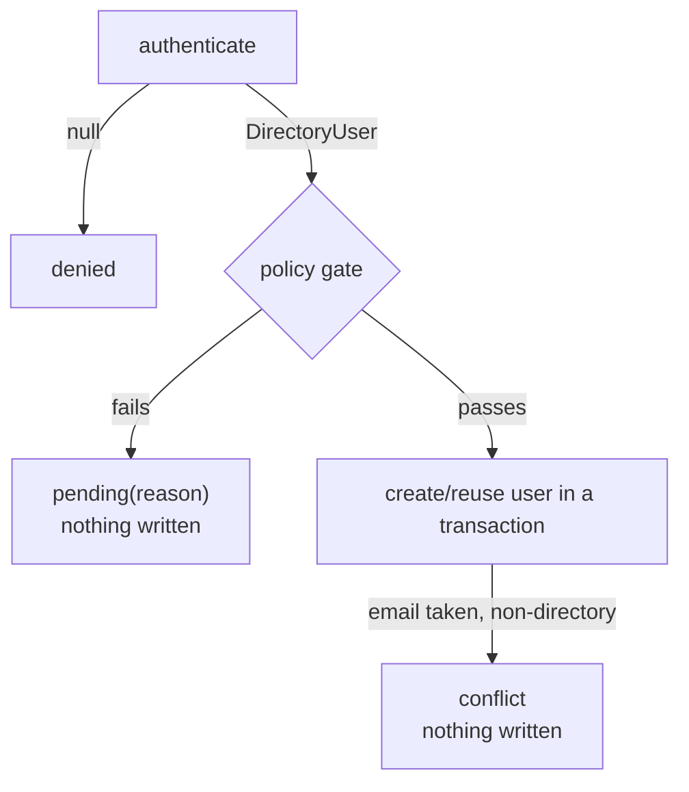

# Fail-closed transport

## The principle

A security control is **fail-closed** when, in the face of any error or ambiguity, it denies rather than
allows. The opposite — fail-*open* — is the classic auth disaster: a bind times out, an exception is caught
"to be safe", and the user is let in anyway. This module is fail-closed at every layer: the only way to get a
successful login is for every step to *explicitly* succeed.

::: callout danger "Fail-open is the default failure mode of careless auth code"
`try { authenticate(); } catch (\Throwable) { /* log and continue */ }` is how a transport error becomes a
silent admission. The fix is structural: make the contract return `null` on failure, so there's no exception
for a caller to mishandle.
:::

## At the connector: null, never throw

`DirectoryConnector::authenticate()` returns `?DirectoryUser`. The contract is explicit: **`null` means
denied / not found**, and an implementation must never let an opaque exception escape:

```php
// DirectoryAuthenticator::login()
$user = $this->connector->authenticate($username, $password);
if ($user === null) {
    return DirectoryOutcome::denied();    // ← the only thing a null can become
}
```

A `null` short-circuits the entire pipeline: no mapping, no policy, no database. Nothing in IAM is touched.

## The built-in LDAP connector catches everything

`Ldap\LdapConnector` is the reference implementation of fail-closed. Every failure mode collapses to `null`:

```php
public function authenticate(string $username, string $password): ?DirectoryUser
{
    $model = $this->query($username);          // query() catches transport errors → null
    if ($model === null || $password === '') {
        return null;                           // unknown user, or empty password → denied
    }

    try {
        if (!$this->connection->auth()->attempt($model->getDn() ?? '', $password)) {
            return null;                       // bind rejected → denied
        }
    } catch (\Throwable) {
        return null;                           // bind / transport error → denied
    }

    return $this->toUser($model);
}
```

- **Unknown user** → `null`.
- **Empty password** → `null` (an anonymous bind must never count as authentication).
- **Bind rejected** → `null`.
- **Bind/transport exception** → caught, `null`.

`query()` is wrapped the same way, so even a search failure (server down, malformed filter) yields `null`
instead of a leaked exception.

## No partial provisioning

The JIT policy is evaluated **before** any write, and a failed check returns `pending(reason)` — never a
half-created user:



And user creation happens inside a `DB::transaction`, so a mid-write failure rolls back rather than leaving an
orphan user without its membership or grants.

## The outcome taxonomy is fail-closed by construction

Only `provisioned` and `linked` are "allow" states, and `DirectoryOutcome::ok()` returns `true` for exactly
those two. Everything else — `denied`, `pending`, `conflict` — is a refusal:

```php
if ($outcome->ok()) {
    Auth::loginUsingId($outcome->userId);   // the ONLY branch that logs anyone in
}
// every other status is a refusal with a reason
```

There is no "unknown" status that a caller might accidentally treat as success.

::: callout warning "The directory grants roles; the PDP decides allow/deny"
Fail-closed here means *provisioning* fails closed. The runtime authorization decision is the
[PDP's](https://doc.laravel-iam-server.padosoft.com) job — and it is fail-closed too. This module never
widens access on error; at worst it denies a legitimate login, which is the safe direction.
:::

## Don't regress this

The tests assert: *invalid credentials → `denied`, with no user or grant created.* Keep it green, and keep
custom connectors returning `null` (not throwing) on every failure.

## Related

- [Custom connector](/guides/custom-connector) — the `null`-not-throw rule for your own sources.
- [Outcomes & reasons](/reference/outcomes) — the full refusal vocabulary.
- [Anti-takeover](/security/anti-takeover) — the other "never fail open" guarantee.
