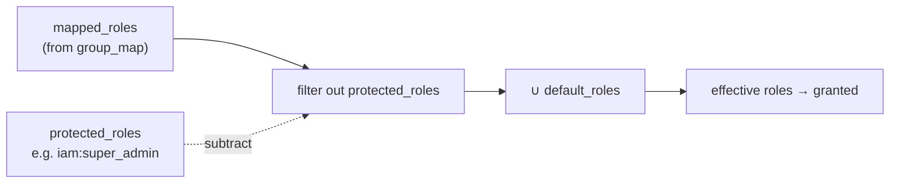

# Protected roles

## The threat: group-map escalation

The `group_map` is configuration, and configuration drifts, gets copy-pasted, and can be tampered with. If a
single row says `'some-group' => 'iam:super_admin'` — whether by a typo, a careless edit, or a compromised
directory that adds the attacker to that group — then *everyone in that group becomes super-admin* on their
next login. The blast radius of one wrong line is the whole system.

::: callout danger "The directory should never be able to mint your most powerful roles"
High-privilege roles (`iam:super_admin`, break-glass roles, billing owners) must be **manual-assignment only**,
asserted by a human with intent — not derivable from a group membership the directory controls.
:::

## The rule: subtract protected roles from the mapped set

`DirectoryProvisioner::rolesToGrant()` filters `protected_roles` **out** of the mapped roles before granting:

$$\text{effective} = \bigl(\text{default\_roles} \cup (\text{mapped\_roles} \setminus \text{protected\_roles})\bigr)$$

So even if `group_map` maps a group to a protected role, that role is removed before any grant is written. No
configuration error and no directory compromise can escalate a user to a protected role through mapping.



## Configuration

```php
'jit' => [
    'group_mapping'   => true,
    'protected_roles' => ['iam:super_admin', 'billing:owner'],   // never granted via the directory
],

'group_map' => [
    // Even this rogue/mistyped row is harmless:
    'cn=interns,ou=groups,dc=acme,dc=com' => 'iam:super_admin',  // → filtered out, never granted
],
```

## Why default_roles are exempt

`protected_roles` are subtracted from **mapped** roles, not from `default_roles`. That's deliberate:
`default_roles` are an explicit operator decision baked into config, not something the directory can
influence per-group. If you put a role in `default_roles`, you've chosen to grant it to every provisioned
user yourself — so it isn't a directory-driven escalation.

::: callout warning "Don't put a sensitive role in default_roles to 'test' it"
`default_roles` bypass the protected-role filter by design. If you want a role to be impossible to grant via
the directory at all, keep it out of *both* `group_map` values *and* `default_roles`, and list it in
`protected_roles` as a belt-and-braces guard against future `group_map` edits.
:::

## Worked example

```php
$policy = DirectoryJitPolicy::fromArray([
    'default_roles'   => ['iam:tenant_member'],
    'group_mapping'   => true,
    'protected_roles' => ['iam:super_admin'],
]);

// group_map resolves jdoe's groups to these mapped roles:
$mapped = ['app:developer', 'iam:super_admin'];   // ← the dangerous one

$provisioner->provision($jdoe, $policy, 'org_123', $mapped);
// effective = (['iam:tenant_member']) ∪ (['app:developer', 'iam:super_admin'] − ['iam:super_admin'])
//           = ['iam:tenant_member', 'app:developer']
// iam:super_admin is NEVER granted.
```

## Defence in depth

Protected roles are one layer. They pair with:

- [Anti-takeover](/security/anti-takeover) — the directory can't *seize* an account, and...
- ...protected roles mean even an account it legitimately owns can't be escalated to your crown-jewel roles.
- The [PDP](https://doc.laravel-iam-server.padosoft.com) is the final authority on what any role can do — this
  module only decides which roles are *granted*.

## Don't regress this

The tests assert: *a `group_map` mapping a protected role results in that role **not** being granted.* Keep it
green.

## Related

- [Authoritative sync](/security/authoritative-sync) — how the effective set becomes grants/revocations.
- [Group → role mapping](/guides/group-mapping) — where mapped roles come from.
- [Config keys](/reference/config) — `jit.protected_roles` and friends.
